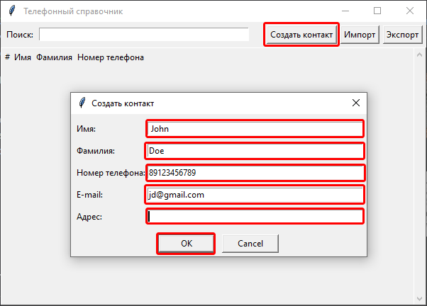
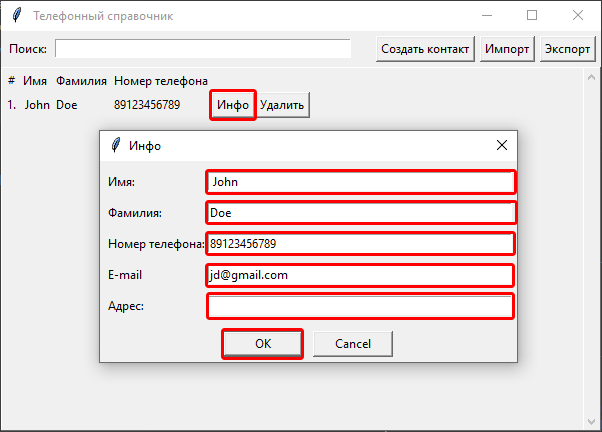
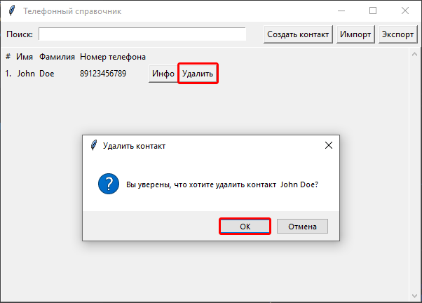
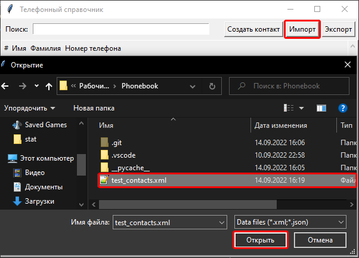
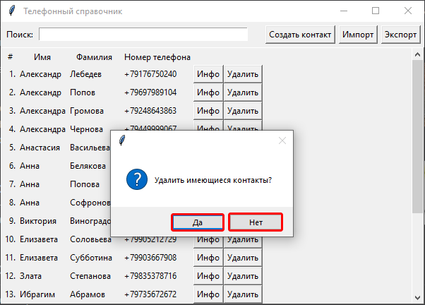
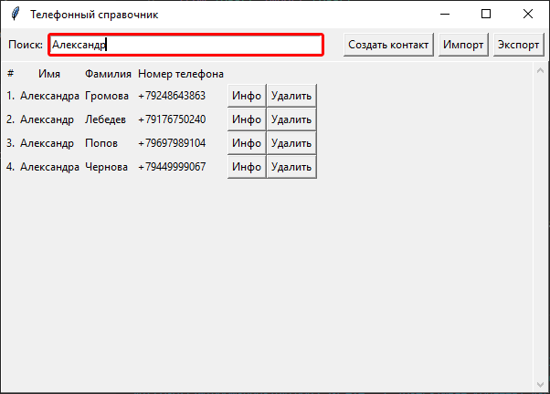
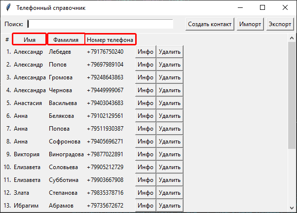
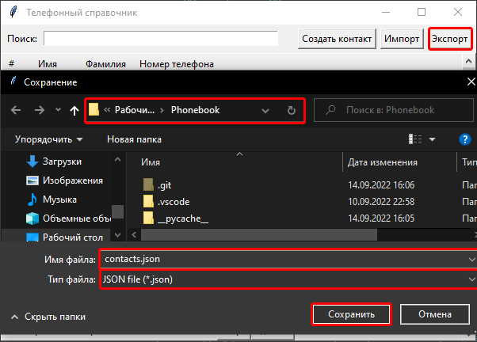

# Phonebook  
#### Телефонный справочник
Десктопное приложение для работы с контактами.
##### Содержание:
- [Внешние зависимости](#Внешние_зависимости)
- [Запуск приложения](#Запуск_приложения)
- [Создание контакта](#Создание_контакта)
- [Просмотр и редактирование контакта](#Просмотр_и_редактирование_контакта)
- [Удаление контакта](#Удаление_контакта)
- [Импорт контактов](#Импорт_контактов)
- [Поиск контакта](#Поиск_контакта)
- [Сортировка контактов](#Сортировка_контактов)
- [Экспорт контактов](#Экспорт_контактов)

# Внешние_зависимости
Для работы приложения необходимо установить библиотеку TKinter.
```sh
pip install tk 
```

# Запуск_приложения
Запуск приложения произаодится из файла main.py
```sh
python Путь_к_приложению\Phonebook\main.py
```

# Создание_контакта
Для создания нового контакта нажмите кнопку "Создать контакт". В открывшемся диалоговом окне введите необходимую информацию о контатке и нажмите "ОК".



# Просмотр_и_редактирование_контакта
Для просотра полной информации о контакте и ее изменения нажмите кнопку "Инфо" напротив необходимого контакта. В открывшемся диалоговом окне измените необходимую информацию и нажмите кнопку "ОК".



# Удаление_контакта
Для удаления контакта нажмите кнопку "Удалить" напротив необходимого контакта. В открывшемся диалоговом окне подтвердите действие.



# Импорт_контактов
Для импорта контактов из файла нажмите кнопку "Импорт". В открывшемся диалоговом окне выберите необходимый файл в формате json или xml и нажмите кнопку "Открыть".
Для тестирования в каталоге приложения представлен файл "test_contacts.xml".




Если в приложении уже содержатся контакты, будет предложено их удалить. Выберите необходимое действие.



# Поиск_контакта
Для поиска контакта в поле "Поиск" введите любую известную информацию о контакте. На экран будут выведены контакты, содержащие введенную информацию. Для вывода всех контактов очистите поле поиск.



# Сортировка_контактов
Для сортировки контактов нажмите на заголовок соответствующего столбца. Для обратной сортировки нажмите на него повторно.



# Экспорт_контактов
Для экспорта контактов в файл нажмите кнопку "Экспорт". В открывшемся диалоговом окне перейдите в каталог для сохранения, выберите необходимый формат (json или xml), укажите имя файла и нажмите кнопку "Сохранить".

